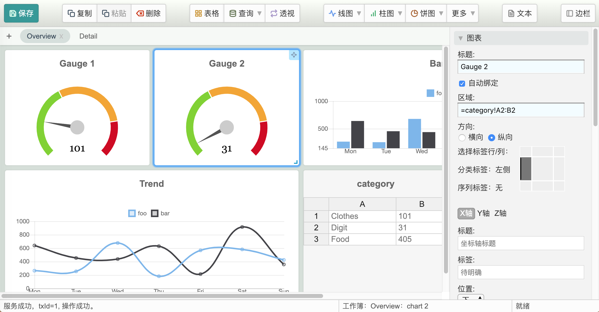

Ferris Wheel
============

A fantastic spreadsheet framework!

To run the example
------------------

    mvn install -Dgpg.skip -DskipTests && mvn spring-boot:run -pl example

Then open your browser (Chrome is recommended) and navigate to:

    http://127.0.0.1:8080/

If 8080 port is taken, you have to configure spring boot to run on another port before you build this project.

Features
--------

* MS Excel alike formula (only a small subset implemented at present)
* Dynamic data loading and runtime query form
* Fundamental pivot table support
* Layout assets easily by just drag and drop
* Extending custom data providers in a quite simple way

Difference with traditional spreadsheet
---------------------------------------

Ferris wheel is *NOT* just another spreadsheet! The major difference between ferris wheel and traditional spreadsheets
is dynamic data loading, which makes ferris wheel an alive spreadsheet!

Traditional spreadsheets ask users to type or import data at the first time, and once the spreadsheet is done, it is a
static document. Well, it's internet age, isn't? Ferris wheel is meant to make spreadsheet alive with internet! What you
made with ferris wheel is not a static document, but with the ability to dynamically load data and render report. Even
further, ferris wheel allows you to set user parameter rules, which makes it possible to alter data loading parameters
as you wish even when you are just reading the report.
